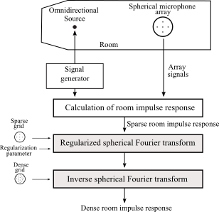
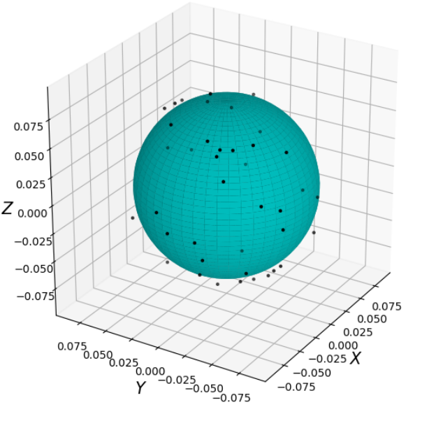

# Spherical Acoustic


## 1. Room impulse response (RIR) interpolation example
An example of RIR interpolation can be run in <a href="https://colab.research.google.com/github/AlarconGanoza/sphericalAcoustic/blob/master/RIR_interpolation_Intercon21_example.ipynb">RIR_interpolation_Intercon21_example.ipynb</a>. (Google Colab notebook)

  - Interpolation errors using the regularized and non-regularized spherical Fourier transform are compared.


## 2. About Spherical Acoustic
Spherical Acoustic is a project focused on room impulse response (RIR) interpolation using the regularized spherical Fourier transform (SFT). The algorithms are applicable to initial data measured by spherical arrays of microphones with different distributions. The project is developed in python although the initial data was simulated in matlab. The general diagram of the RIR interpolation is shown below.

<div align="center">

</div>

## 3. Libraries available
Currently there are 2 libraries:
|Library name           | description                                         |
|-----------------------|-----------------------------------------------------|
|<a href="https://github.com/AlarconGanoza/sphericalAcoustic/blob/master/sphericalAcoustics.py">sphericalAcoustics.py</a>  | Functions related to regularized SFT                |
|<a href="https://github.com/AlarconGanoza/sphericalAcoustic/blob/master/tools.py">tools.py</a>| Functions related to the points distribution on the sphere and 3D signal plotting|


## 4. Simulated acoustic data available
Some RIRs simulated in Matlab are available in <a href="https://github.com/AlarconGanoza/sphericalAcoustic/tree/master/initialRIR">/initialRIR</a> .
RIRs simulated can be used in tests as initial data and target data.


## 5. Usage
To use the libraries you have to copy both .py files to the work environment and import.

For example, to generate and plot a random distribution of **L** points on a sphere of radius 8 cm.

```python
import sphericalAcoustics as sac
import tools as sat
import matplotlib.pyplot as plt

x = sat.randDist(L=40, r=0.08)
fig = sat.plotDist(x)
plt.show()
```

<div align="center">

</div>


## 6. References
[1] J. Alarcón, J. Solis, and C. D. Salvador, “Regularized spherical Fourier transform for room impulse response interpolation,” XXVII International Conference on Electronics, Electrical Engineering, and Computing (INTERCON), Lima, Peru, August 2021.
[DOI: 10.1109/INTERCON52678.2021.9532805]

## 7. Author
  - J. Alarcón.

  - <a href="https://cesardsalvador.github.io/index.html"> Cesar D. Salvador</a>.

  - Javier Solis Lastra.
