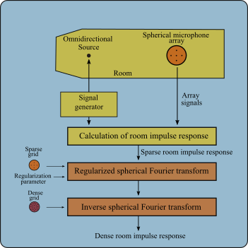

# Spherical Acoustic

## 1. About Spherical Acoustic
Spherical Acoustic is a project focused on room impulse response (RIR) interpolation using the regularized spherical Fourier transform. The algorithms are applicable to initial data measured by spherical arrays of microphones with different distributions. The project is developed in python although the initial data was simulated in matlab using the smir_generator tool.

## 2. Libraries available

## 3. Initial acoustic data available

## 4. Usage

## 5. Interpolation example

## 6. Author
